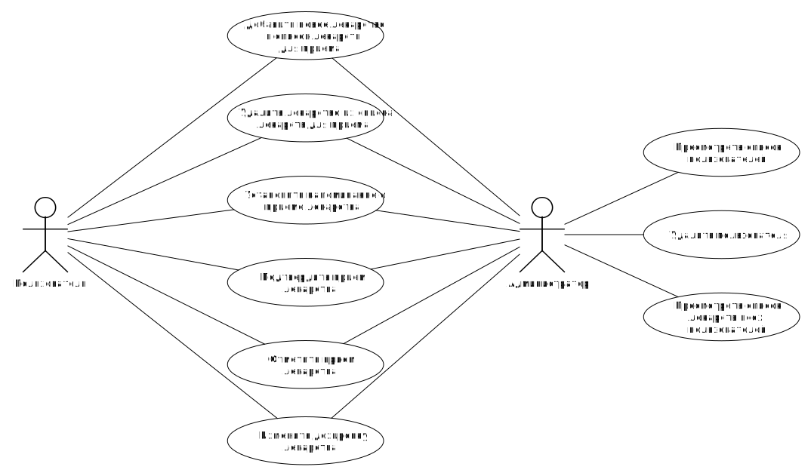
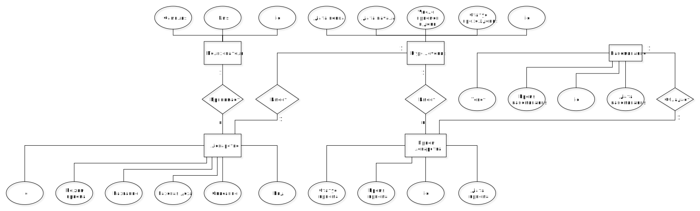
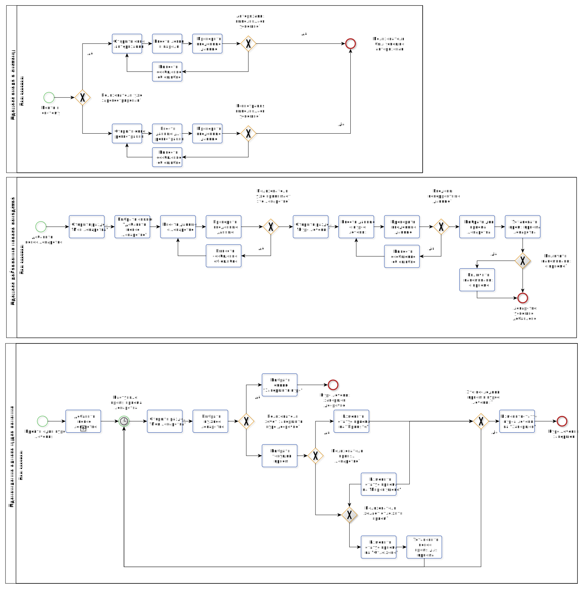

# ППО. Лабораторная №1

## 1. Название проекта

​	MediSync

## 2. Краткое описание идеи проекта 

​	MediSync – система учета приема лекарств предназначена для людей, которые  периодически забывают вовремя принимать лекарственные препараты. Пользователь может добавлять лекарства в список учета приема лекарств, настраивать уведомления о приеме и вести учет принятых лекарств.

## 3. Краткое описание предметной области

​       Контроль приема лекарств – это важная часть здорового образа жизни, особенно для людей, которые страдают хроническими заболеваниями. Употребление медикаментов, как правило, требует строгого соблюдения дозировки и расписания. Нарушение режима приема лекарств может привести к серьезным последствиям для здоровья. Некоторые медикаменты могут не действовать, если их принимать не по расписанию, а другие могут привести к побочным эффектам, если превышена дозировка или пропущен прием.

## 4. Краткий анализ аналогичных решений по минимум 3 критериям

| Название | Возможность установки напоминаний | Возможность формирования отчета о приеме | Наличие истории приема |
|-------------|---|---|---|
| Мои таблетки | + | - | + |
| Aerovu | + | - | + |
| MyTherapy | + | - | + |
| Предлагаемое решение  | + | + | + |

## 5. Краткое обоснование целесообразности и актуальности проекта

​	Целесообразность и актуальность проекта по разработке системы учета приема лекарств обусловлена следующими факторами:

* **повышение эффективности лечения**: система учета приема лекарств помогает пациентам соблюдать регулярный прием лекарственных препаратов в соответствии с предписанными инструкциями. Это повышает эффективность лечения и уменьшает вероятность осложнений заболеваний.

* **улучшение качества жизни пациентов**: правильное соблюдение режима приема лекарств способствует контролю над заболеванием и улучшению состояния здоровья, что приводит к повышению качества жизни пациентов.

## 6. Краткое описание акторовз

|Роль|Описание |
|--|--|
|**Гость**|Пользователь посещает сайт без создания учетной записи или входа в систему. Для доступа к основному функционалу системы необходимо войти или зарегистрироваться. |
|**Пользователь**|Пользователь, имеющий возможность добавлять/удалять лекарства из списка приема лекарств, устанавливать напоминания о приеме, управлять дозировками.|
|**Администратор**|Пользователь с повышенными привилегиями, который контролирует общую работу системы. У него есть доступ ко всем функциям и настройкам, включая управление учетными записями пользователей. Администраторы также имеют возможность изменять дизайн и макет сайта, а также настраивать функциональность.|

## 7. Use-Case - диаграмма

## 8. ER-диаграмма сущностей

## 9. Пользовательские сценарии

1. Сценарий добавления нового лекарства:

   - пользователь переходит в раздел "Мои лекарства" и выбирает опцию "Добавить новое лекарство";
   - заполняет соответствующую информацию о лекарстве, длительности курса приема и т.д. в соответствующие поля;
   - выбирает дни приема;
   - выбирает время приема (приемов в день может быть несколько);
   - формируется расписание приемов;
   - подтверждает добавление лекарства.

2. Сценарий настройки уведомлений о приеме:

   - пользователь переходит в раздел "Мои лекарства" и выбирает одно из лекарств;
   - разрешает допуск уведомлений на устройстве;
   - включает уведомления о приеме.

3. Сценарий просмотра истории приемов:

   - пользователь переходит в раздел "Мои лекарства" и выбирает одно из лекарств;
   - выбирает опцию "Посмотреть историю приемов";
   - просматривает содержимое истории приемов выбранного лекарства.

4. Сценарий редактирования данных о лекарстве:

   - пользователь переходит в раздел "Мои лекарства" и выбирает одно из лекарств;
   - выбирает опцию "Изменить данные о лекарстве";
   - вносит изменения в данные о выбранном лекарстве;
   - сохраняет изменения.

## 10. Формализация ключевых бизнес-процессов

