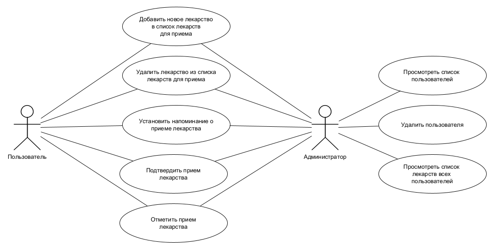

# ППО. Лабораторная №1

## 1. Название проекта

​	MediSync

## 2. Краткое описание идеи проекта 

​	Данная система учета приема лекарств предназначена для людей, которые  периодически забывают вовремя принимать лекарственные препараты. Основная идея проекта заключается в том, что пользователь может добавлять лекарства в список учета приема лекарств, настраивать уведомления о приеме и вести учет принятых лекарств.

## 3. Краткое описание предметной области

​	... напишу позже ...

## 4. Краткий анализ аналогичных решений по минимум 3 критериям

​	... напишу позже ...

## 5. Краткое обоснование целесообразности и актуальности проекта

​	... напишу позже ...

## 6. Краткое описание акторов

​	Роли: 

1. пользователь;

2. администратор.

## 7. Use-Case - диаграмма

   
