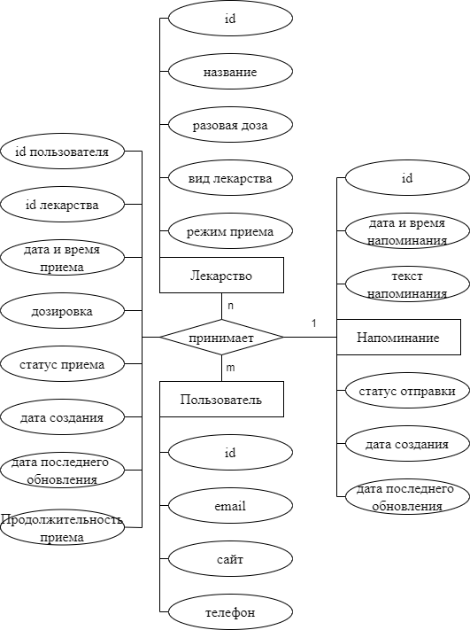

# ППО. Лабораторная №1

## 1. Название проекта

​	MediSync

## 2. Краткое описание идеи проекта 

​	MediSync – система учета приема лекарств предназначена для людей, которые  периодически забывают вовремя принимать лекарственные препараты. Пользователь может добавлять лекарства в список учета приема лекарств, настраивать уведомления о приеме и вести учет принятых лекарств.

## 3. Краткое описание предметной области

​       Контроль приема лекарств – это важная часть здорового образа жизни, особенно для людей, которые страдают хроническими заболеваниями. Употребление медикаментов, как правило, требует строгого соблюдения дозировки и расписания. Нарушение режима приема лекарств может привести к серьезным последствиям для здоровья. Некоторые медикаменты могут не действовать, если их принимать не по расписанию, а другие могут привести к побочным эффектам, если превышена дозировка или пропущен прием.

## 4. Краткий анализ аналогичных решений по минимум 3 критериям

| Название | Возможность установки напоминаний | Возможность управления дозировкой | Наличие истории приема |
|-------------|---|---|---|
| Мои таблетки | + | - | + |
| Aerovu | + | - | + |
| Medisafe | + | - | + |
| Предлагаемое решение  | + | + | + |

## 5. Краткое обоснование целесообразности и актуальности проекта

​	Целесообразность и актуальность вашего проекта по разработке системы учета приема лекарств обусловлены следующими факторами:

1. **Повышение эффективности лечения**: Система учета приема лекарств помогает пациентам соблюдать регулярный прием лекарственных препаратов в соответствии с предписанными инструкциями. Это повышает эффективность лечения и уменьшает вероятность осложнений заболеваний.
2. **Улучшение качества жизни пациентов**: Правильное соблюдение режима приема лекарств способствует контролю над заболеванием и улучшению состояния здоровья, что приводит к повышению качества жизни пациентов.
3. **Предотвращение ошибок при приеме лекарств**: Система учета приема лекарств помогает предотвратить ошибки в приеме лекарств, такие как пропуск дозы или неправильное сочетание препаратов, что может привести к серьезным осложнениям.

## 6. Краткое описание акторов

|Роль|Описание |
|--|--|
|**Пользователь**|Пользователь, имеющий возможность добавлять/удалять лекарства из списка приема лекарств, устанавливать напоминания о приеме, управлять дозировками.|
|**Администратор**|Пользователь с повышенными привилегиями, который контролирует общую работу системы. У него есть доступ ко всем функциям и настройкам, включая управление учетными записями пользователей. Администраторы также имеют возможность изменять дизайн и макет сайта, а также настраивать функциональность.|

## 7. Use-Case - диаграмма

   

## 8. ER-диаграмма сущностей

